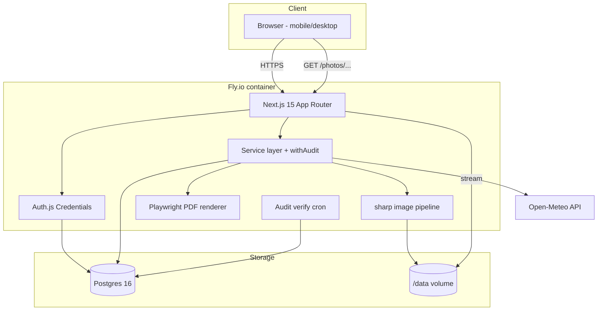

<!--
  Delivery plan for the Stavební deník project — committed copy of the
  working plan maintained by Junie at ~/.junie/plans/stavebni-denik-nextjs.md.
  Kept in-repo so the plan is version-controlled and survives independently
  of any local tooling state. See docs/PROGRESS.md for the live status snapshot.
-->

# Requirements

### Overview & Goals
Jednoduchá webová aplikace pro vedení **stavebního deníku** dle § 157 stavebního zákona (zákon č. 283/2021 Sb.) a přílohy č. 16 vyhlášky č. 499/2006 Sb. v platném znění. Cíl: nahradit papírový deník elektronickou verzí, která splní zákonné náležitosti, je použitelná z mobilního prohlížeče na stavbě a zabezpečí prokazatelnou neporušitelnost záznamů.

Aplikace běží jako **single-tenant** instance jedné firmy na Fly.io, fotografie se ukládají na perzistentní volume vedle aplikace, audit log používá hash chain pro tamper-evidence.

### Scope

#### In Scope
- Ruční správa uživatelů administrátorem (přidání podle nickname, systém generuje silné heslo).
- Role **BOSS** (stavbyvedoucí / admin), **WORKER** (pracovník), **GUEST/DOZOR** (TDS, koordinátor BOZP, investor) a rozšiřitelný číselník rolí.
- RBAC s wildcard-resistentními kontrolami v service layeru.
- Správa zakázek (staveb) s identifikačními údaji dle vyhlášky.
- Denní záznamy (hlášení / „kontrolní den“) se všemi povinnými položkami.
- Upload fotek s automatickým resize (sharp) a generováním náhledu.
- Snapshot aktuálního počasí z Open-Meteo při vytvoření denního záznamu.
- Checklist „materiál na další dny“.
- Připomínky TDS / dozoru jako samostatné záznamy ke dni.
- Workflow podpisů: denní podpis stavbyvedoucího, podpisy TDS při návštěvě; po podpisu se den uzamkne.
- Tamper-evident audit log (hash chain) všech mutací, žádné tvrdé mazání.
- PDF export deníku ke kontrole / archivaci.

#### Out of Scope
- Multi-tenant (více firem v jedné instanci).
- Offline / PWA režim.
- Mobilní nativní appka.
- Elektronické kvalifikované podpisy (lze přidat později).
- SSO / OAuth providery — jen lokální účty.
- Fakturace, docházka, sklad materiálu, BIM.

### User Stories
- Jako **BOSS** chci přidat nového pracovníka zadáním nicknamu a získat vygenerované heslo, abych mu ho mohl předat.
- Jako **BOSS** chci založit zakázku se všemi identifikačními údaji stavby, abych na ní mohl vést deník dle zákona.
- Jako **WORKER** chci vytvořit denní hlášení, nahrát fotky a popsat provedené práce, abych splnil povinnost denního záznamu.
- Jako **WORKER** chci, aby se mi při vytvoření hlášení automaticky vyplnilo aktuální počasí (povinný údaj), abych nemusel ručně dohledávat.
- Jako **WORKER** chci do hlášení doplnit checklist „materiál na další dny“, abych předal informace dál.
- Jako **GUEST/DOZOR** (TDS) chci si přečíst denní záznamy a přidat svou připomínku, ale nesmím nic mazat ani měnit cizí záznamy.
- Jako **BOSS** chci denně podepsat záznam a tím ho uzamknout, aby splňoval požadavek § 157.
- Jako **BOSS** chci si stáhnout PDF deníku za libovolné období pro stavební úřad nebo investora.
- Jako **BOSS** chci v audit logu vidět kdo a kdy co změnil, abych nemohl být obviněn z falšování.

### Functional Requirements

#### Povinné položky denního záznamu (per vyhláška 499/2006 Sb., příloha 16)
- Datum záznamu.
- Jméno a příjmení stavbyvedoucího nebo osoby zajišťující stavební dozor.
- **Počasí** v průběhu dne (slovní popis + teplota °C, vítr, srážky).
- Počet pracovníků v jednotlivých profesích / firmách.
- Popis a množství prováděných prací.
- Dodávky materiálu, výrobků, strojů.
- Nasazení mechanizace.
- Provedené zkoušky a měření.
- Kontroly a rozhodnutí orgánů státního dozoru, koordinátora BOZP, TDS.
- Bezpečnostní opatření / mimořádné události.
- Závady, poruchy, jejich příčiny a řešení.
- Připomínky TDS, koordinátora BOZP, projektanta.
- Další skutečnosti významné pro průběh stavby.
- Podpisy (denně stavbyvedoucí, při návštěvě TDS).

#### Identifikační údaje stavby (vyplňují se 1× při založení)
Název a místo stavby, parcelní čísla a katastr, stavebník, zhotovitel, stavbyvedoucí (jméno + autorizace ČKAIT), TDS, koordinátor BOZP, projektant, číslo stavebního povolení / společného povolení.

#### Acceptance criteria
- Po podpisu denního záznamu nejde upravit obsah; lze přidat **dodatek** (errata), který se k záznamu připojí a je rovněž auditován.
- Žádné UI tlačítko „smazat trvale“; vše je `soft delete` přes `deleted_at` a stále viditelné pro BOSS v archivu.
- Audit log obsahuje pro každou mutaci: actor, action, entity_type, entity_id, before (JSONB), after (JSONB), ip, user_agent, `prev_hash`, `row_hash`.
- Verifikační job projde celou audit_log a zkontroluje hash chain; výsledek zobrazí v admin UI.
- Generované heslo má min. 12 znaků, mix tříd, ukáže se přesně jednou při vytvoření uživatele.
- Foto je po uploadu zmenšeno na max 1920 px delší strany (JPEG q=82) + thumbnail 400 px; originál se nedrží.

### Non-Functional Requirements
- **Bezpečnost**: HTTPS only, HTTP-only secure cookies, argon2id hash hesel, CSRF tokens, rate limiting na login, security headers (CSP, HSTS).
- **Lokalizace**: česky (UI texty), Europe/Prague timezone, formát data dd.MM.yyyy.
- **Přístupnost**: responsive layout od 360 px, mobile-first; čitelné na slunci (kontrast, velká tlačítka).
- **Výkon**: TTFB < 500 ms u typických stránek; upload fotky do 10 MB.
- **Provoz**: denní automatický dump Postgresu + snapshot volume; runbook pro obnovu.
- **Compliance**: GDPR — minimum osobních údajů, retence dle zákona (deník 10 let po kolaudaci).

# Technical Design

### Current Implementation
Projekt začíná na zelené louce. Repo `nessenceai/mn4-hlaseni` není dostupné (404 / private), takže nestavíme na žádném existujícím kódu.

**Lokální cesta projektu**: `/Users/saymoon/Work-GIT/slack/stavebni-denik` (sourozenec existujících projektů `das`, `prodaas`, `snippets`, `work-reporter`, `workhours` v `/Users/saymoon/Work-GIT/slack/`). Tato složka zatím neexistuje a vytvoří se v rámci Stage 1. Vzdálené repo bude pojmenováno `stavebni-denik` (případně dle preference později přejmenovat na `mn4-hlaseni`).

### Key Decisions
- **Framework**: Next.js 15 (App Router) v TypeScriptu. Jeden deploy unit, React Server Components pro většinu stránek, server actions pro mutace, API route handlers pro upload a webhooky.
- **ORM + DB**: Prisma 5 + Postgres 16. Migrace přes `prisma migrate`.
- **Auth**: vlastní implementace s `Auth.js v5` (next-auth) Credentials providerem, `argon2id` hashování přes balíček `@node-rs/argon2`, sessions v Postgres tabulce, HTTP-only secure cookies. Žádní externí provideři.
- **RBAC**: tabulka `role` + enum-like seed (`BOSS`, `WORKER`, `GUEST`), permissions kontrolovány v service layeru (`assertCan(user, 'report.sign', report)`), middleware na route úrovni je jen druhá obrana.
- **Audit log s hash chain**: každá mutace prochází `withAudit(...)` wrapperem v service layeru. Tabulka `audit_log` je append-only — Postgres role aplikace má `INSERT, SELECT` práva, ale `REVOKE UPDATE, DELETE`. Každý řádek nese `prev_hash` (= hash předchozího řádku) a `row_hash` (= sha256 ze serializovaného obsahu + `prev_hash`). Cron job (denně) ověří celou řetěz a zaloguje výsledek.
- **Storage fotek**: lokální Fly volume v `/data/photos/{projectId}/{reportId}/{uuid}.{jpg|webp}`, metadata v Postgres tabulce `photo`. Soubory čte jen aplikace, ven se servírují přes auth-gated route.
- **Image processing**: `sharp` — resize na 1920 px delší stranu (JPEG q=82) + 400 px thumbnail; EXIF se strippuje kromě `DateTimeOriginal` a `GPSLatitude/Longitude` (uložené do `photo.captured_at`, `photo.gps`).
- **Weather snapshot**: Open-Meteo (free, bez API klíče). Když se vytvoří `daily_report`, server zavolá Open-Meteo s GPS stavby a uloží snapshot (teplota min/max, popis, vítr, srážky) do JSONB sloupce. Nikdy se nepřepisuje.
- **PDF export**: Playwright v headless režimu renderuje `/print/project/{id}?from=...&to=...`, výstup je PDF s diakritikou + hash chain footerem každé stránky.
- **UI**: Tailwind CSS 4 + shadcn/ui (Radix) komponenty, formuláře přes `react-hook-form` + `zod` validace, toast notifikace `sonner`.
- **Soft delete only**: každá entita má `deleted_at`. UI nemá tvrdé delete tlačítko; pro BOSS je archiv-view.

### Architecture Diagram


### Data Models / Contracts
Prisma schema (zkráceně):
```prisma
model User {
  id            String   @id @default(cuid())
  nickname      String   @unique
  displayName   String
  passwordHash  String
  role          Role     @default(WORKER)
  ckaitNumber   String?  // pro stavbyvedoucího
  isActive      Boolean  @default(true)
  mustChangePwd Boolean  @default(true)
  createdAt     DateTime @default(now())
  createdById   String?
  deletedAt     DateTime?
  sessions      Session[]
}

enum Role { BOSS WORKER GUEST }

model Session {
  id        String   @id @default(cuid())
  userId    String
  expiresAt DateTime
  user      User     @relation(fields: [userId], references: [id])
}

model Project { // zakázka / stavba
  id            String   @id @default(cuid())
  name          String
  address       String
  cadastralArea String
  parcelNumbers String
  permitNumber  String?
  builder       String   // stavebník
  contractor    String   // zhotovitel
  siteManagerId String   // stavbyvedoucí (User)
  tdsName       String?
  bozpName      String?
  designerName  String?
  gpsLat        Float?
  gpsLon        Float?
  startedAt     DateTime?
  endedAt       DateTime?
  deletedAt     DateTime?
  reports       DailyReport[]
  members       ProjectMember[]
}

model ProjectMember {
  projectId String
  userId    String
  role      Role
  @@id([projectId, userId])
}

model DailyReport {
  id              String   @id @default(cuid())
  projectId       String
  date            DateTime // den
  authorId        String
  workersByTrade  Json     // [{trade, count}]
  workDescription String
  materialsIn     String?
  machinery       String?
  testsAndChecks  String?
  safetyNotes     String?
  defects         String?
  otherNotes      String?
  weather         Json     // snapshot z Open-Meteo
  signedAt        DateTime?
  signedById      String?
  lockedAt        DateTime?
  deletedAt       DateTime?
  photos          Photo[]
  remarks         Remark[]
  materialNeeds   MaterialNeed[]
  addenda         Addendum[]
  @@unique([projectId, date])
}

model Photo {
  id          String   @id @default(cuid())
  reportId    String
  pathOriginal String  // /data/photos/.../{uuid}.jpg
  pathThumb   String
  width       Int
  height      Int
  bytes       Int
  capturedAt  DateTime?
  gps         Json?
  uploadedById String
  createdAt   DateTime @default(now())
  deletedAt   DateTime?
}

model Remark { // připomínka TDS / dozoru
  id        String   @id @default(cuid())
  reportId  String
  authorId  String
  text      String
  createdAt DateTime @default(now())
  deletedAt DateTime?
}

model MaterialNeed { // checklist materiálu na další dny
  id        String   @id @default(cuid())
  reportId  String
  text      String
  neededBy  DateTime?
  resolved  Boolean  @default(false)
  resolvedAt DateTime?
  deletedAt DateTime?
}

model Addendum { // dodatek po podpisu
  id        String   @id @default(cuid())
  reportId  String
  authorId  String
  text      String
  createdAt DateTime @default(now())
}

model AuditLog {
  id         BigInt   @id @default(autoincrement())
  ts         DateTime @default(now())
  actorId    String?
  action     String   // 'report.create', 'photo.upload', ...
  entityType String
  entityId   String
  before     Json?
  after      Json?
  ip         String?
  userAgent  String?
  prevHash   String   // hex sha256
  rowHash    String   // hex sha256
}
```

Servisní kontrakt:
```ts
// src/server/audit.ts
export async function withAudit<T>(
  ctx: { user: SessionUser; ip: string; ua: string },
  action: string,
  entityType: string,
  entityIdResolver: (result: T) => string,
  before: unknown,
  fn: () => Promise<T>
): Promise<T> {
  return prisma.$transaction(async (tx) => {
    const result = await fn();
    const last = await tx.auditLog.findFirst({ orderBy: { id: 'desc' } });
    const prevHash = last?.rowHash ?? '0'.repeat(64);
    const payload = canonicalJSON({ action, entityType,
      entityId: entityIdResolver(result), actorId: ctx.user.id,
      before, after: result, ip: ctx.ip, ua: ctx.ua, prevHash });
    const rowHash = sha256Hex(payload);
    await tx.auditLog.create({ data: { ...parse(payload), rowHash } });
    return result;
  });
}
```

DB role:
```sql
CREATE ROLE app LOGIN PASSWORD '...';
GRANT SELECT, INSERT, UPDATE, DELETE ON ALL TABLES IN SCHEMA public TO app;
REVOKE UPDATE, DELETE ON audit_log FROM app;
```

### Components
- **`/app/(auth)/login`** — login formulář, povinný first-time password change.
- **`/app/admin/users`** — BOSS: seznam, vytvoření (modal s generovaným heslem zobrazeným 1×), deaktivace.
- **`/app/projects`** — seznam zakázek (BOSS vytváří, WORKER/GUEST vidí přiřazené).
- **`/app/projects/[id]`** — detail zakázky + kalendář dní + tlačítko „Nový denní záznam“.
- **`/app/projects/[id]/reports/[date]`** — denní záznam: formulář, fotky, počasí (snapshot), připomínky, checklist materiálu, tlačítko „Podepsat a uzamknout“.
- **`/app/admin/audit`** — BOSS-only: prohlížeč audit logu + tlačítko „Ověřit integritu řetězu“.
- **`/app/print/project/[id]`** — server-rendered HTML pro Playwright PDF.
- **API**: `POST /api/photos/upload`, `GET /photos/[id]`, `GET /api/weather?lat&lon&date`, `POST /api/reports/[id]/sign`.

### File Structure
```
repo-root/
├─ prisma/
│  ├─ schema.prisma
│  └─ migrations/
├─ src/
│  ├─ app/
│  │  ├─ (auth)/login/page.tsx
│  │  ├─ admin/users/page.tsx
│  │  ├─ admin/audit/page.tsx
│  │  ├─ projects/page.tsx
│  │  ├─ projects/[id]/page.tsx
│  │  ├─ projects/[id]/reports/[date]/page.tsx
│  │  ├─ print/project/[id]/page.tsx
│  │  └─ api/
│  │     ├─ photos/upload/route.ts
│  │     ├─ photos/[id]/route.ts
│  │     └─ reports/[id]/sign/route.ts
│  ├─ server/
│  │  ├─ auth.ts            // Auth.js config + argon2
│  │  ├─ audit.ts           // withAudit + verifyChain
│  │  ├─ rbac.ts            // assertCan
│  │  ├─ weather.ts         // Open-Meteo client
│  │  ├─ images.ts          // sharp pipeline
│  │  ├─ pdf.ts             // Playwright wrapper
│  │  └─ services/{users,projects,reports,photos}.ts
│  ├─ components/ui/...     // shadcn/ui
│  ├─ components/forms/...
│  └─ lib/{db.ts, crypto.ts, password-gen.ts, dates.ts}
├─ scripts/
│  ├─ verify-audit.ts        // cron entry-point
│  └─ seed.ts
├─ Dockerfile
├─ fly.toml
├─ .env.example
└─ README.md
```

### Risks
- **Tamper přes DB admina**: hash chain pomůže detekovat, ale neuchrání. Mitigace — denní externí archivace `row_hash` posledního řádku (např. e-mailem BOSSovi a do druhého úložiště).
- **Ztráta fotek při pádu volume**: Fly volume je single-host. Mitigace — nightly `tar | restic` snapshot na R2/B2 v rámci zálohovacího jobu (i když primárně chceme jen volume, záloha je nutná).
- **Open-Meteo nedostupné**: fallback — uložit `weather = {error, fetchedAt}`, ruční doplnění s flagem `manuallyEntered=true` v auditu.
- **Diakritika v PDF**: Playwright + systémové fonty (Liberation Sans / Inter) ji zvládají, ale je třeba ověřit v CI screenshot testem.
- **Kvalifikace ČKAIT a elektronický podpis**: aktuální verze nenahrazuje QES; výstup je „elektronicky vedený deník“ s vlastní integritou. Pro plné nahrazení v budoucnu lze doplnit eIDAS/QES.

# Testing

### Validation Approach
Každá stage v Delivery Plan obsahuje vlastní testy. Důraz je na **audit log integritu** a **RBAC**, protože jsou bezpečnostně kritické. Použijeme Vitest pro unit/integration testy server kódu a Playwright pro pár end-to-end happy-path scénářů. Pro DB testy se spouští Postgres v Dockeru přes `testcontainers`.

### Key Scenarios
- **Login & first password change**: nový uživatel se přihlásí vygenerovaným heslem → je donucen ho změnit → nové heslo se ověří argon2.
- **BOSS přidá WORKERa**: heslo se vygeneruje, zobrazí přesně jednou, hash se uloží, v audit logu je `user.create` s `before=null`, `after={...bez hashe}`.
- **WORKER vytvoří denní záznam**: formulář projde validací (zod), počasí se snapshotuje z Open-Meteo (v testu mock), audit log obsahuje `report.create`.
- **Upload fotky**: 5 MB JPEG → resize na 1920 px + thumb 400 px, EXIF strippován (kromě GPS), audit log `photo.upload` s velikostí a hash.
- **GUEST přidá připomínku, ale nemůže editovat**: `assertCan(guest, 'report.update')` → 403; `assertCan(guest, 'remark.create')` → ok.
- **Podpis & lock**: BOSS podepíše den → `signedAt`, `lockedAt` se nastaví → pokus o `report.update` → 403 i pro BOSSa, lze jen `addendum.create`.
- **PDF export**: vygeneruje PDF s českou diakritikou + tabulkou počasí + fotkami + hash chain footerem.
- **Audit verify**: `pnpm run verify-audit` projde celou tabulku a vrátí `OK` na čerstvé DB; po umělé úpravě jednoho řádku přes superuser session detekuje break a vrátí ID problémového řádku.

### Edge Cases
- Pokus o vytvoření 2 záznamů pro stejný den a zakázku → unique constraint `@@unique([projectId, date])` → 409.
- Nahrání souboru, který není obrázek → sharp throws → 400 + nic v audit logu (mimo `withAudit` blok).
- Open-Meteo timeout 5 s → fallback `weather.error = 'timeout'`, UI upozorní BOSSa že je třeba doplnit ručně, ruční hodnoty mají `manuallyEntered=true`.
- Pokus o smazání uživatele, který má záznamy → blokujeme; lze jen deaktivovat (`isActive=false`).
- Soft-deleted entita se nezobrazí v běžných listech, ale v BOSS archivu ano.
- Concurrent edit denního záznamu dvěma WORKERy → optimistic locking přes `updatedAt` token; druhý dostane 409 s diff.
- Login brute-force → rate limit 5 pokusů / 15 min na nickname + 20 / 15 min na IP.

### Test Changes
- **Unit (Vitest)**: `password-gen`, `audit hash chain`, `rbac.assertCan`, `weather client` (s `msw` mockem), `images.resize` (golden file).
- **Integration (Vitest + testcontainers Postgres)**: services CRUD scénáře, `withAudit` v transakci, ověření hash chainu po každé operaci, role grants.
- **E2E (Playwright)**: 3 happy paths — onboarding uživatele, vytvoření a podpis denního záznamu s fotkou, PDF export.
- **CI**: GitHub Actions — lint → typecheck → unit → integration → e2e → build. Sekret `OPEN_METEO_BASE` mockován.

# Delivery Steps

### ✓ Step 1: Bootstrap, infra a deploy-skeleton
Zelená louka Next.js projektu v `/Users/saymoon/Work-GIT/slack/stavebni-denik`, který se po dokončení této fáze nasadí na Fly.io s prázdnou databází a perzistentním volume a vrací `200 OK` na `/healthz`.

- Vytvořit adresář `/Users/saymoon/Work-GIT/slack/stavebni-denik`, inicializovat git repozitář (`git init`, `main` branch) a v něm inicializovat **Next.js 15** (App Router, TypeScript, ESLint, Prettier) s **Tailwind 4** a **shadcn/ui** baseline.
- Nastavit **Prisma 5** s Postgres datasource, prvotní `schema.prisma` (jen `User` a `Session`) a `prisma migrate`.
- `Dockerfile` (multi-stage, Node 22, Playwright deps) + `fly.toml` s volumem mountovaným na `/data`.
- `.env.example` (DATABASE_URL, AUTH_SECRET, OPEN_METEO_BASE, DATA_DIR).
- Healthcheck endpoint `/healthz` (DB ping + volume write probe).
- Layout `app/layout.tsx` s českou lokalizací, Europe/Prague timezone, globálním Toaster.
- GitHub Actions CI: install, lint, typecheck, build.

### ✓ Step 2: Autentizace a správa uživatelů s generovaným heslem
BOSS se umí přihlásit, vytvoří přes UI WORKERa/GUESTa, dostane vygenerované heslo zobrazené přesně 1×, uživatel se přihlásí a je donucen změnit heslo.

- Auth.js v5 **Credentials provider** + `@node-rs/argon2` (argon2id), session uložená v Postgresu (`Session` model).
- HTTP-only secure cookie, CSRF token, security headers (CSP, HSTS, X-Frame-Options).
- Rate limit na `/api/auth/...` přes `iron-session`-style sliding window v Postgresu.
- `lib/password-gen.ts` — 12+ znaků, mix tříd; `mustChangePwd=true` po vytvoření.
- Stránky `/login`, `/first-password-change`, redirect přes proxy (`src/proxy.ts`).
- Stránky `/admin/users` (BOSS-only): list, modal „Nový uživatel“ (nickname, displayName, role, ČKAIT u BOSS), po vytvoření zobrazí heslo + tlačítko „Zkopírovat“, deaktivace přes `isActive`.
- Soft delete only, žádné tvrdé mazání uživatelů.
- Unit testy pro `password-gen` a `argon2` wrapper, integration test pro flow `create → first login → change password`.

### * Step 3: RBAC a tamper-evident audit log (hash chain)
Každá mutace v aplikaci prochází `withAudit` wrapperem, který vloží řádek do append-only `audit_log` s hash chainem; admin UI umí zobrazit log a spustit verifikaci celého řetězu.

- Migrace `audit_log` tabulky + Postgres role `app` s `REVOKE UPDATE, DELETE ON audit_log`.
- `src/server/audit.ts` — `withAudit()` v Prisma transakci, `canonicalJSON()` + `sha256Hex()`, `prevHash` ze `findFirst orderBy id desc`.
- `src/server/rbac.ts` — `assertCan(user, action, resource)`, matice oprávnění pro BOSS/WORKER/GUEST.
- Zpětně zabalit user/session mutace ze Stage 2 do `withAudit`.
- Stránka `/admin/audit` (BOSS-only): filtry (actor, entity, datum), detail řádku s diffem before/after.
- Tlačítko + scripts/verify-audit.ts (`pnpm verify:audit`) — projde celou tabulku, vrátí `OK` nebo ID prvního porušeného řádku; výsledek jde i do souboru `/data/audit-verify.log`.
- Cron job (`fly machine schedule` nebo GitHub Actions) spouští verifikaci 1× denně a posílá e-mail na BOSS při selhání.
- Integration testy: simulovaná manipulace přes raw SQL → verifikace detekuje break.

###   Step 4: Zakázky a identifikační údaje stavby
BOSS umí založit zakázku se všemi povinnými identifikačními údaji a přiřadit členy; WORKER a GUEST vidí jen své zakázky.

- Prisma modely `Project` a `ProjectMember`, migrace.
- Service `projects.create/update/listForUser/addMember/removeMember`, vše přes `withAudit`.
- Validace přes zod (parcelní čísla, GPS lat/lon volitelně přes mapový picker).
- Stránky `/projects` (list se scope filtrem dle role), `/projects/new` (BOSS), `/projects/[id]` (detail + záložky Záznamy / Členové / Údaje stavby).
- Soft delete (`deletedAt`), archiv-view pro BOSS.
- RBAC: BOSS = full, WORKER = read přiřazené + write reports, GUEST = read přiřazené + write remarks.
- E2E test: BOSS založí zakázku, přiřadí WORKERa, ten ji vidí; nepřiřazený WORKER ji nevidí.

###   Step 5: Denní záznamy, fotky, počasí a checklist materiálu
WORKER vytvoří denní záznam pro zakázku, nahraje fotky (server je zmenší), počasí se automaticky snapshotuje a lze přidat checklist materiálu na další dny.

- Prisma modely `DailyReport`, `Photo`, `Remark`, `MaterialNeed`, `Addendum` + migrace. Unique `(projectId, date)`.
- Formulář `/projects/[id]/reports/[date]` s react-hook-form + zod: pracovníci po profesích, popis prací, materiály, mechanizace, zkoušky, BOZP, závady, ostatní.
- `src/server/weather.ts` — Open-Meteo klient s 5 s timeoutem, fallback `weather.error`; snapshot zapsán do `weather` JSONB při `report.create`.
- `src/server/images.ts` — sharp pipeline: validace MIME, resize 1920 px (JPEG q=82) + 400 px thumbnail, EXIF strip (kromě DateTimeOriginal a GPS).
- API `POST /api/photos/upload` (multipart), `GET /photos/[id]` (auth-gated stream ze `/data`).
- UI sekce „Připomínky“ (GUEST/TDS může psát) a „Materiál na další dny“ (checklist se stavem resolved).
- Všechny mutace přes `withAudit`.
- Integration testy: report create vytvoří weather snapshot z mockovaného Open-Meteo, photo upload vrátí zmenšenou verzi, RBAC blokuje editaci cizího reportu.

###   Step 6: Podpisy, lock, PDF export a produkční hardening
BOSS podepíše denní záznam a tím ho uzamkne; produkční instance je nasazena, zazálohována a má funkční PDF export celého deníku.

- Workflow podpisu: `POST /api/reports/[id]/sign` (BOSS-only), nastaví `signedAt`, `signedById`, `lockedAt`; další `report.update` vrací 403, povolen jen `addendum.create`.
- Podobně podpis TDS přidá záznam `remark` s flagem `isOfficial=true` a podepsaným `signedAt`.
- Playwright PDF: route `/print/project/[id]?from=&to=`, `src/server/pdf.ts` spouští Chromium headless v containeru, výstup obsahuje hlavičku stavby, denní záznamy, fotky (thumb), počasí, podpisy a v patičce každého listu `audit row hash` posledního zahrnutého řádku.
- Tlačítko „Stáhnout PDF za období“ na `/projects/[id]`.
- Backup job (nightly): `pg_dump | gzip | restic` na Backblaze B2 nebo R2 (přes env credentials), spolu s `/data/photos`. Restore runbook v `README.md`.
- Monitoring: Plain-text logs, `/healthz` probe, Fly alerty na CPU/RAM/disk.
- Smoke E2E v CI proti dočasné staging instanci: login → vytvoř projekt → vytvoř report → upload fotky → podepiš → stáhni PDF.
- README s deploy guide, seed scriptem (1× BOSS účet), návodem k obnově.